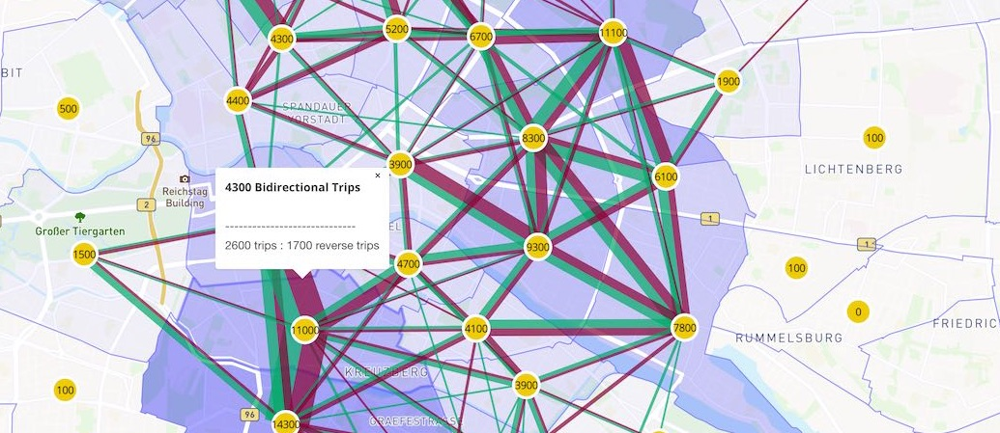

_("Spider Diagrams")_

This viz shows aggregated flows between areas defined by a shapefile. The default view shows everything all at once for every centroid-to-centroid pair. This can be overwhelming, so you can also click on an individual centroid to see just the flows to and from that selected zone.

## Usage

A file named `viz-od*.yml` must be present in working folder. Each yml file matching that pattern will produce a separate Aggregate O/D diagram.

**viz-od-example.yml**

```yaml
---
# all of the below are required except description and idColumn.
---
title: "My Aggregate Viz"
description: "this will be in the sidebar"
shpFile: Bezirksregionen_zone_GK4_fixed.shp
dbfFile: Bezirksregionen_zone_GK4_fixed.dbf
csvFile: od-analysis-hourly-drt.csv
projection: GK4
scaleFactor: 100
idColumn: "id"
```

**Shapefile:** The DBF data must contain a column with the ID of the zones/regions. This ID will be used to identify the O/D flows in the CSV file

- if the `idColumn` is not specified in YAML then the default `id` will be used.
- If no ID column can be found, then the plot will attempt to use the first column in the DBF file.

**O/D CSV File format:**

- Header line contain labels; first two column names will be used for from/to (e.g. origin/destination)
- Column 1: 'From' category
- Column 2: 'To' category.
- All further columns list flows from/to. For example, there could be 24 columns, one for each hour of travel

```
origin;destination;1;2;3;4;5;6;7;8;9;10;11;12;13;14;15;16;17;18;19;20;21;22;23;24
88;88;0;0;0;0;0;0;0;0;0;0;0;0;0;0;0;0;0;0;0;0;0;0;0;0
88;89;0;0;0;0;0;0;0;0;0;0;0;0;0;0;0;0;0;0;0;0;0;0;0;0
88;110;0;0;0;0;0;0;0;0;0;0;0;0;0;0;0;0;0;0;0;0;0;0;0;0
88;111;0;0;0;0;0;0;0;0;0;0;0;0;0;0;0;0;0;0;0;0;0;0;0;0
88;112;0;0;0;0;0;0;0;0;0;0;0;0;0;0;0;0;0;0;0;0;0;0;0;0
etc...
```
