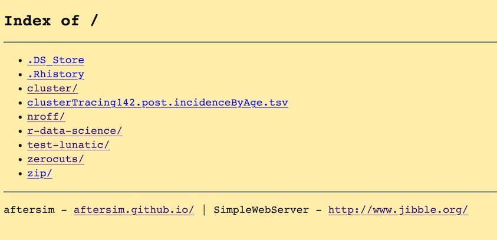

You don't need to set up any external file servers or upload outputs to subversion to use aftersim: you can explore the files stored on your own laptop right away.

This is great for debugging runs and for files that you cannot make public (or that you don't want to make public just yet).

All you need to do is run the **Mini File Server** program on your local machine, in the folder that you want aftersim to have access to. It is a simple HTTP web server that lets your browser access that folder (and only that folder) via `localhost:8000`. Your machine's default firewall will prevent any outside network or internet access.

Here's how to set it up.

<!--truncate-->

### Install the "Mini File Server"

Follow [these instructions on downloading and running the Mini File Server](https://aftersim.github.io/docs/docs/aftersim-intro#viewing-local-folders-on-your-computer) to get started.

Once you've installed it, run it in the folder that you want aftersim to have access to.

To verify that mini file server is running, browse to <http://localhost:8000> and you should see a file listing, maybe something like this:

_sample file listing: it works!_

### Using aftersim with the local mini file server

Once it's running and serving files from the proper folder, you can browse to [aftersim.github.io/local](https://aftersim.github.io/local) and explore the files and subfolders inside the directory. Closing the server will stop sharing the files.

Now you can add and debug YAML files for visualizations you want to create for your model outputs!

Let us know if you have trouble setting it up!
